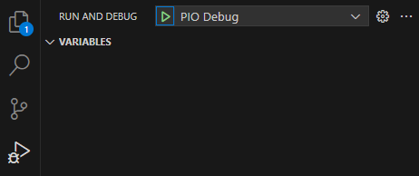

# Possible Use-Cases
- Switching and dimming LEDs:
  - The baord offers two channels with N-Mosfets for switching and dimming LEDs.
- WS2812/SK6812 LED strips:
  - The board offers a connector for WS2812/SK6812 LED strips including a level shifter for 5V
- The baord cane either be powered by USB or an external power supply and provides 5V via buck converter
- Some of the pins are exposed on the back side to connect an ePaper display
- The board is equipped with an ESP32-C3 module, including reset and boot button
- The board offers a Qwiic connector for I2C devices
- On the backside of the board a CAN transceiver may be connected for usage in a vehicle
  - You may connect to the onboard bus for milage and power consumption data
  - the gathered data can then be transmitted to you home wifi and home automations system
  - you max monito your vehicle during charging

# Pinout

# Initial Flashing
The module may be stuck in a loop of connecting and disconnecting from the USB port. This is due to the module not being flashed with the correct firmware. To flash the module, follow the steps below:
1. Install ESP32 C3 JTAG drivers:  [ESP-IDF Tools Installer](https://docs.espressif.com/projects/esp-idf/en/stable/esp32c3/get-started/windows-setup.html#get-started-windows-tools-installer) and select the driver "Espressif - WinUSB support for JTAG (ESP32-C3/S3)"
2. Connect baord while holding the BOOT button
3. Flash the blinky project in debug mode from the PIO debug menu: 
   
   
4. After flashing, the module should be detected as a USB device and the LED should blink
5. You can now flash the board as usual, using the upload and monitor buttons in the PIO toolbar
   
   